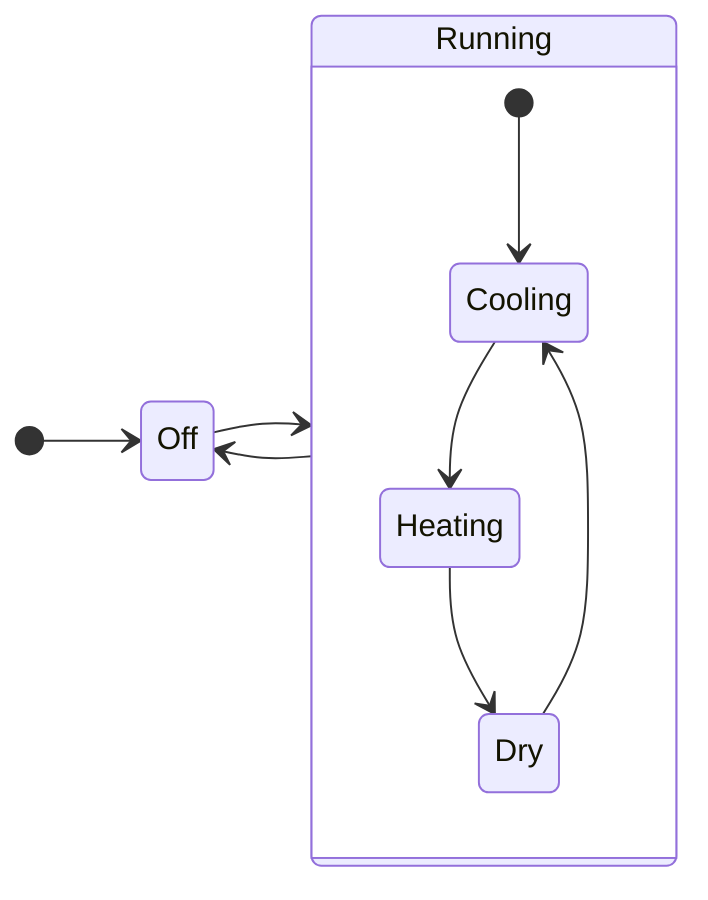

Python の enum には Flag という機能があることを知りました。入れ子の状態(直和集合にあたるもの)を表現するのに便利そうだと思い使ってみました。
今回はエアコンの状態を例に説明します。



```python
from enum import Flag, IntEnum, auto

class State(Flag):
    Off = auto()
    Cooling = auto()
    Heating = auto()
    Dry = auto()
    Running = Cooling | Heating | Dry
```

まず enum 同様以下のように使用できます。

```python
# わかりやすいようにあえて変数名は heat にします
heat = State.Heating

heat
> <State.Heating: 4>

heat == State.Heating
> True

heat == State.Dry
> False

```

しかし属する親状態への判定が enum だとできません。

```python
heat == State.Running
> False
```

代替案として以下のように列挙することになります。

```python
heat == State.Heating or heat == State.Dry or heat == State.Cooling
> True
```

ここで Flag の OR 定義を活かすことができます。

` Running = Cooling | Heating | Dry`

```python
# 同様
heat in State.Heating
> True

# 同様
heat in State.Dry
> False

# 判定可能！
heat in State.Running
> True
```

2 重以上の状態に対してももちろん有効です。

```python
class State(Flag):
    Off = auto()
    Cooling = auto()
    HeatingWeak = auto()
    HeatingStrong = auto()
    Heating = HeatingWeak | HeatingStrong
    Dry = auto()
    Running = Cooling | Heating | Dry

State.HeatingWeak in State.Running
> True
```

### Rust の enum

```rust
enum Heating {Weak, Strong }
enum Running { Cooling, Heating(Heating), Dry }
enum State { Off, Running(Running) }

fn main() {
    let state = State::Running(Running::Heating(Heating::Strong));
    // match する
    // State::Running(Running::Heating(Heating::Strong))
    // State::Running(Running::Heating(_))
    // State::Running(_)
    // match しない
    // State::Running(Running::Cooling)
    // State::Off
```

[enum 超まとめ python3\.10 \- Qiita](https://qiita.com/macinjoke/items/13aa9ba64cf9b688e74a)

[Rust の enum の集合論的な見方：直和集合としての enum](https://zenn.dev/exyrias/articles/d8b56fc900900b4238a9)

[Swift の Enum で見る代数的データ型ついて \- Qiita](https://qiita.com/kz_morita/items/d6da40446ec22635c457#%E7%9B%B4%E5%92%8C%E5%9E%8B%E3%81%AE%E3%83%A1%E3%83%AA%E3%83%83%E3%83%88)
